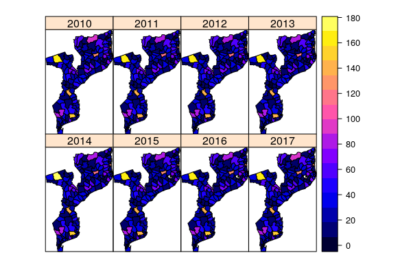

```{r setup, include=FALSE}
knitr::opts_chunk$set(echo = TRUE, warning = FALSE, error = FALSE)
library(lattice) # for graphics 
library(RColorBrewer)
library(sp)
library(maptools)
library(latticeExtra)
library(rgdal)
library(tmap)
library(cowplot)
library(ggplot2)
library(ggpubr)
library(dplyr)
library(EpiWeek) # for creating epiweek variables
library(tidyverse) # for additional data transformation
library(haven) # for loading data
library(stringr) # for manipulating 
library(readr) # for loading data
library(pander) # for reporting table coefficients
library(coda) # gelman
load('analysis.RData')

```

## Introduction

### Burden of Malaria in Africa and WHO efforts

Considerable effort has been made in the past 60 years to identify the precise number of *Plasmodium falciparum* malaria deaths and clinical episodes in Africa [@snow2014sixty]. The major difficulty in identifying the burden has been attributable due to the limitations in health reporting systems. Prior to 2000, the infrastructure in the health systems across Africa was not well established to systematically collect, analyze, and report on the clinical and economic impact of malaria. But all of this changed after setting 'reduction of malaria incidence' as *Target 6c* within the **Millenium Development Goals** (MDG) set by the member states of the United Nations to be achived by 2015. The MDG report of 2015 indicates that throughout the years from 2000 and 2015, over 6.2 million malaria deaths have been averted, global incidence and mortality rate has falled by an estimated 37% and 58% respectively, and more than 900 million insecticide-treated mosquito nets were delivered to malaria-endemic countries in sub-Saharan Africa between 2004 and 2014[@bhatt2015effect]. 

Of the efforts made by WHO to prevent malaria incidence, insecticide-treated nets (ITN) and indoor residual spraying (IRS) were the main interventions that were distributed across Africa as cheap and effective measures for fighting off malaria. As a short description, ITNs provide further protection compared to non-insecticide-treated nets as they 1) kill mosquitoes, 2) repel mosquitoes from entering the house and 3) reduce the number and length of life of mosquitoes given that high community coverage is achieved. Similarly, IRS provides protection by 1) killing mosquitoes and 2) preventing transmission of infection to other person. To be effective, IRS must be applied to very high proportion of households in an area (usually > 80%).  


### Translating WHO effort into Research

From the efforts of the global community, numerous studies[@west2014indoor, @pinder2015efficacy, @lines2015malaria, @deressa2016combining, @ngufor2014combining] have been conducted to determine the impact of preventive interventions (i.e. ITN and IRS) on the incidence of malaria cases in various areas of Africa. Based on the results indicated from the previous studies, the effect of IRS and ITN seemed to be highly dependent on 1) adherence levels of utilization of IRS and ITN, 2) differences in transmission rate among areas and 3) age distribution of individuals. Additionally, different areas of Africa resulted in different results regarding the impact of IRS and ITN on malaria incidence. Specifically, a study conducted in Côte d’Ivoire did not indicate any significant difference between those huts who had ITN vs. those who didn't[@ngufor2014combining]. In comparison, ITN was singnificantly effective in a study conducted in Gambian communities[@pinder2015efficacy]. 

## Rationale and Objective

Although there has been many studies, as described in the previous section, conducted to confirm and determine the impact of ITN and IRS on malaria incidence, the results do not clearly confirm whether or not there is a statistically significant impact. Additionally, there were no studies that incorporated decaying effects of both ITN and IRS[@wanjala2015insecticidal] in addition to the effects of spatial variables such as community effects[@hawley2003community] or the lagged impact of weather (i.e. @tian2008one and @craig1999climate) on malaria incidence. Specific to the area of our interest, Mozambique, there have not been studies that looked at the incorporating both 1) the decaying effect of ITN and IRS protection such as that of Wanjala et al.[@wanjala2015insecticidal] and 2) the lagged effects of weather on malaria incidence such as that of Ikeda et al.[@ikeda2017seasonally].


In order to extend the research and analyses described above, our goal for this study was to incorporate weather information, decaying impact of ITN and IRS, and other spatio-temporal variables necessary to determine the impact of ITN and IRS on malaria incidence in Mozambique from 2010 to 2017. Specifically this paper investigated 1) the impact of ITN and IRS coverage on malaria incdence over time and 2) whether weather variables had an impact on malaria incidence over time.


## Material and Methods

### Data
#### Incidence Data

Malaria case data for Mozambique, South Africa were collected from January 2010 to July 2017. The incident cases were reported through the local health systems and were collected at the district level at a weekly frequency. Other district level information included district population data, which were obtained from WorldPop, and the 2007 Mozambique census data were used to estimate the proportion of the population $\lt 5$  years of age. Additional geographical information (i.e. squared kilometer and latitude and longitudinal information of district) was also included. The estimated population under age 5 within the district is used as the population at risk during the time period for the poisson regression analysis. Incidence rates were thus calculated by the aggregate incidence within the district, which was multiplied by 1000 to obtain incidence rate per 1000 person-week. 


#### Weather Data

Weather data were obtained from the GLobal Land Data Assimilation System and included daily rainfall, minimum, maximum and average temperature, relative humidity, saturation vapor pressure deficit, and surface barometric pressure (a general indicator of large-scale weather activity and exhibits a strong seasonal cycle). Since information was captured daily, average values of the weather data per week were utilized for the poisson regression.

#### Intervention Data 

Intervention data was also captured through the local health systems via records based on the MDG efforts mentioned earlier[@plucinski2014evaluation, @lee2017economic]. Intervention data incorporated both ITN and IRS start dates for the districts that were distributed either ITN and/or IRS. 

### Analysis
#### ITN and IRS decay

For investigating the association between ITN and IRS protection (scaled from 0 to 1 with 1 being 100% protection) on Malaria incidence, we utilized a decaying rate of protection over time for ITN and IRS with an exponential decay model for both interventions (See Appendix A.1 for details).  

#### Lagged Weather

The association between weather data (listed above) and the weekly incidence of malaria was modeled by incorporating 0, 2, 4 and 8 weeks lagged effect of weather on malaria incidence in the poisson regression model. 

### Data Analysis

#### Generalized Linear Mixed Model Framework

The estimation of the effect of ITN and IRS protection and weather variables' effect on malaria incidence has been modeled using 1) a standard maximum likelihood estimation approach (via Lapalce Approximation) and 2) a Bayesian approach through MCMC (Markov Chain Monte Carlo) simulation of the posterior distribution. The standard regression model is as such:


\begin{aligned}
g(\mu) & = \log(\Bbb{E}[Y]) =  \Bbb{X}\beta + \Bbb{Zb} \\

\end{aligned}

Where the $g(\mu)$ models the mean of the poisson distribution via the natural log link. The covariates that are included in the final model were ITN and IRS protection (scaled from 0 to 1), average temperature (in C$^\circ$), rain (mm/week), Relative Humidity (%), saturation vapor pressure deficit (mmHg), surface barometric pressure (hPa), under 5 total population within the district (as offset variable), time in years, and two interaction terms between time and IRS and time and ITN. The conitnuous variables have been centered and scaled for faster convergence. The weather variables were weekly mean values. The time variable's was specified as a natural cubic spline with $df = 3$.  

For the bayeisan estimation of the effects, specification of the location effects ($\beta$ and $u$) are as such:

\begin{aligned}
\begin{bmatrix}
\boldsymbol{\beta} \\
\boldsymbol{u} \\
\boldsymbol{e}
\end{bmatrix}  \sim N \left 
( \begin{bmatrix}
\boldsymbol{\beta_0} \\
\mathbf{0} \\
\boldsymbol{0}
\end{bmatrix} ,
 \begin{bmatrix}
\Bbb{B} & 0 & 0 \\
0 & \Bbb{G} & 0 \\
0 & 0 & \Bbb{R} 
\end{bmatrix}

\right )
\end{aligned}


as indicated in [@hadfield2012mcmcglmm]. The $\beta_0$ are the prior means for the fixed effects which were specified as a multivariate normal prior distribution with mean 0 and diagnoal matrix with large variances (1e+10) except for that of the log offset of the under 5 total(i.e. u5total) specified to act as the offset (i.e. $\beta = 1$ and $V = 1e-09$) for calculation of the incidence ratio. The $\Bbb{G}$ and $\Bbb{R}$ structured are specified as an inverse-Wishart distribution with individual elements for each of the components specified as weekly informative priors (The scale matrix of the inverse-Wishart is set to the univariate special case (i.e. inverse-gamma distribution) with a $df = 1$ such that we have a weak prior. see Appendix A.4.2). Same with the maximum likelihood approach, our distribution of the residual and link function will be "poisson" and "log". We have specified 4 chains to be run (in parallel) for mixing of the chains (Appendix A.3.4). For each of the chains we have 3000 burn-in sets with a thinning interval of 10 and sample size per chain set as 1000. 


## Result

### Average ITN and IRS Protection (%) Over Time

```{r ITN_IRS, echo=FALSE}

shinyAppDir(
  "./IntProt",
  options = list(
    width = "100%", height = 660
  )
)
```
<h1 class="small">**Figure 1.** The figure indicates the average protective effect (scaled from 0 to 1, where 1 is 100% protection) of Insecticide Treated Bed Net (ITN) and Indoor Residual Spraying (IRS) protection throughout the years selected. **LEFT :** Average ITN protection percentage within the year selected. **RIGHT :** Average IRS protection percentage within the year selected.</h1> 

Based on the interactive figure that indicates the level of ITN and IRS protection, IRS has a wider coverage, in terms of the intervention being delivered at a greater scale, compared to the ITN's across Mozambique. Areas that had greater protection in the past 3 years (i.e. 2015 - 2017) with regards to ITN are Northern regions such as MALEMA, MECUBURI, NAMAPA_ERATI, MECONTA< and recently MOGINCUAL, whereas from 2013 to 2015 there were higher coverage in the southern and central regions, which does exhibit a greater rate of malaria incidence (Appendix A2.3). Based on initial descriptive analysis, there were 6, 16, 15 and 1 IRS interventions that were delivered to the central, coastal, northern, and souther region respectively. With respect to ITN intervention delivery, there were 34, 56, 49, and 15 interventions were delivered to the central, coastal, northern, and souther region respectively.


### Geographic Distribution of Malaria Incidence Over Time

<center>  </center>

<h1 class="small">**Figure 2.** The figure indicates the Average malaria incidence per 1000 from 2010 to 2017. There isn't much variability over time. The Average incidence rates in each year were below 170 per 1000 people over the range of 2010 to 2017. </h1> 

There were 6 districts that had $\gt 100$ cases per 1000 population each year (from pink to yellow color coded districts in Figure 2) from 2010 to 2017. Namely, Chibabava, Cidade de Inhambane, Lalaua, Maravia, Mecufi, and Panda were the districts that had an average of 143, 127, 123, 166, 130, and 147 cases of malaria (per 1000 population) from years 2010 to 2017. There were no distinct variability in the incidence rate throughout the years. 


### Impact of Weather on Malaria Incidence per 1000

```{r weath_mal, echo=FALSE}

shinyAppDir(
  "./weatherMal",
  options = list(
    width = "100%", height = 520
  )
)
```
<h1 class="small">**Figure 3.** The impact of weather variables on the incidence of malaria. Through the drop-down options, one can choose the impact of 1. Daily rainfall (mm), 2. Daily average temperature (C), 3. Relative humidity (%), 4. Saturdation vapor pressure deficit (mmHg), and 5. Surface barometric pressure (hPa) on malaria incidence. The figure also depicts the 'lagged' effect of each variables. Specifically, The impact of each weather variables with regards to 2 week, 4 week, and 8 week lagged (and No lag) effect on malaria incidence is plotted. </h1> 

#### Average Daily Temperature 
Based on the smoothed curve (via generalized additive model) displayed in Figure 3, as the average daily temperature (C$^\circ$/week) increases, there was an increasing trend up to 27 C$^\circ$ and then the incidence declines (for all lagged and non-lagged temperature variables) somewhat like a quadratic relationship is displayed. 

#### Average daily rainfall 
The average daily rainfall (mm/per week) on the other hand seemed to display a positive linear relationship with malaria incidence. The incidence of malaria was  greatest when the (lagged and non-lagged) rainfall amount was at the highest. 

#### Average relative humidity 
Accounting for no lag, 2 weeks lag and 4 weeks lag effect on malaria incidence, as the average relative humidity (%/week) increased from 20% to 90%, the incidence of malaria seemed to increase up to approximately 40 cases/1000 populaiton. However, the relationship between malaria incidence reversed from 90% onwards, as the relative humidity increases a sharp decline in malaria incidence is exhibited. Additionally, when accounting for a lag of 8 weeks the trend seemed to be increasing from 20% to 40% then the incidence of malaria seemed to drop with greater percentage of relative humidity steadily up to 90% then a steep drop in malaria incidence is exhibited similar to the effect of shorter lag periods described above.

#### Average saturation vapor pressure deficit


#### Average surface barometric pressure


### Impact of Intervention on Malaria Incidence per 1000

```{r int_inc_int, echo=FALSE}

shinyAppDir(
  "./malincpan",
  options = list(
    width = "100%", height = 430
  )
)
```
<h1 class="small">**Figure 4.** The figure indicates the impact of Insecticide Treated Bed Net (ITN) and Indoor Residual Spraying (IRS) protection on malaria incidence. **TEAL :** The impact of ITN protection on malaria incidence. **RED :** The impact of IRS protection on malaria incidence.</h1> 


### Generalized Linear Mixed Effect Model Regression Coefficient


```{r mcmcresult, echo=FALSE}
panderOptions('table.split.table', Inf)
resultab<- cbind(summary(models[[1]])$statistics[,1:2], summary(models[[2]])$statistics[,1:2], summary(models[[3]])$statistics[,1:2], summary(models[[4]])$statistics[,1:2])
rownames(resultab) <- c("Intercept", "ITN", "IRS", "Avg. Temp (C)", "Avg Rain (mm/week)", "Rel. Humidity (%)", "Vapor Pressure (mmHg)","Surface Pressure (hPa)", "Under 5 Total", "Time", "ITN:Time", "IRS:Time")
colnames(resultab) <- c("M1 mean", "M1 SD", "M2 mean", "M2 SD", "M3 mean", "M3 SD", "M4 mean", "M4 SD")
pander(resultab)
```
<h1 class="small">**Figure 4.** The figure indicates the impact of Insecticide Treated Bed Net (ITN) and Indoor Residual Spraying (IRS) protection on malaria incidence. **TEAL :** The impact of ITN protection on malaria incidence. **RED :** The impact of IRS protection on malaria incidence.</h1> 


```{r coefplot, echo = FALSE, fig.align='center', fig.width=7, fig.asp=0.8}

# plot all 4 MCMC model coefficients
plot_mcmod <- function(y) {
  
  # extract each of the MCMC models from list and get parameter estimates
  x <- summary(y[[1]])
  x2 <- summary(y[[2]])
  x3 <- summary(y[[3]])
  x4 <- summary(y[[4]])
  
  # creating plot scheme
  n <- dim(x$statistics)[1]
  par(mar=c(2, 10, 4, 1))
  plot(x$statistics[,1], n:1,
       yaxt="n", ylab="",
       xlim=range(x$quantiles)*1.2,
       pch=19,
       main="Posterior means and 95% credible intervals", col=c("red"))
  points(x2$statistics[,1], n:1, pch=19, col = "blue")
  points(x3$statistics[,1], n:1, pch=19, col = "green")
  points(x4$statistics[,1], n:1, pch=19, col = "yellow")
  grid()
  axis(2, at=n:1, rownames(x$statistics) <- c("Intercept", "ITN", "IRS", "Avg. Temp (C)", "Avg Rain (mm/week)", "Rel. Humidity (%)", "Vapor Pressure (mmHg)","Surface Pressure (hPa)", "Under 5 Total", "Time", "ITN:Time", "IRS:Time") , las=2) # originally rownames(x$statistics)
  arrows(x$quantiles[,1], n:1, x$quantiles[,5], n:1, code=0)
  abline(v=0, lty=2)
  legend("bottomleft", legend = c("Model 1", "Model 2", "Model 3", "Model 4"), lty = c(1,2,3,4), col = c("red","blue","green","yellow"))
}


par(mfrow=c(1,1))
plot_mcmod(models)
```
<h1 class="small">**Figure 4.** The figure indicates the impact of Insecticide Treated Bed Net (ITN) and Indoor Residual Spraying (IRS) protection on malaria incidence. **TEAL :** The impact of ITN protection on malaria incidence. **RED :** The impact of IRS protection on malaria incidence.</h1> 
## Conclusion


## References

<div id="refs"></div>

## Appendix

Appendix file can be found in https://github.com/ck2136/malaria2k17.
